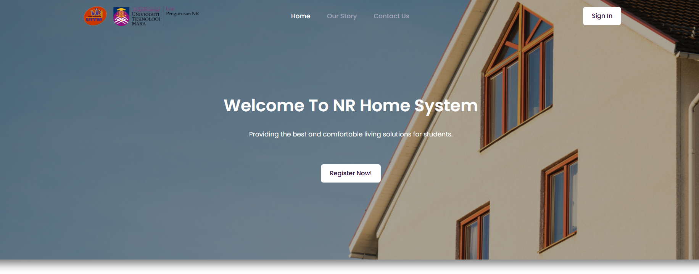
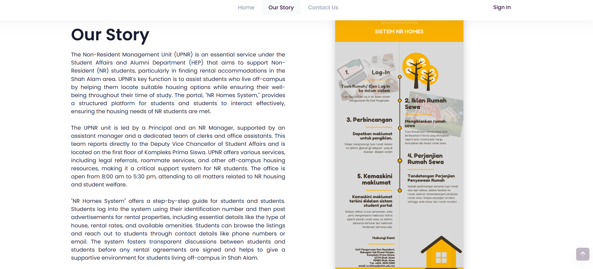
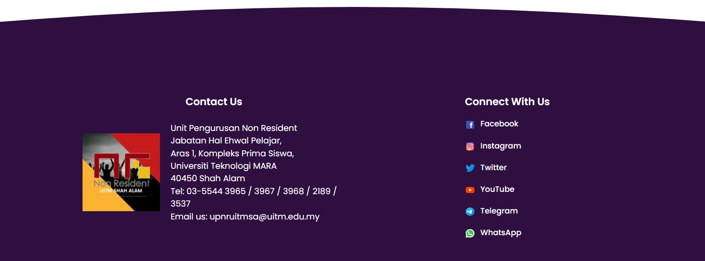
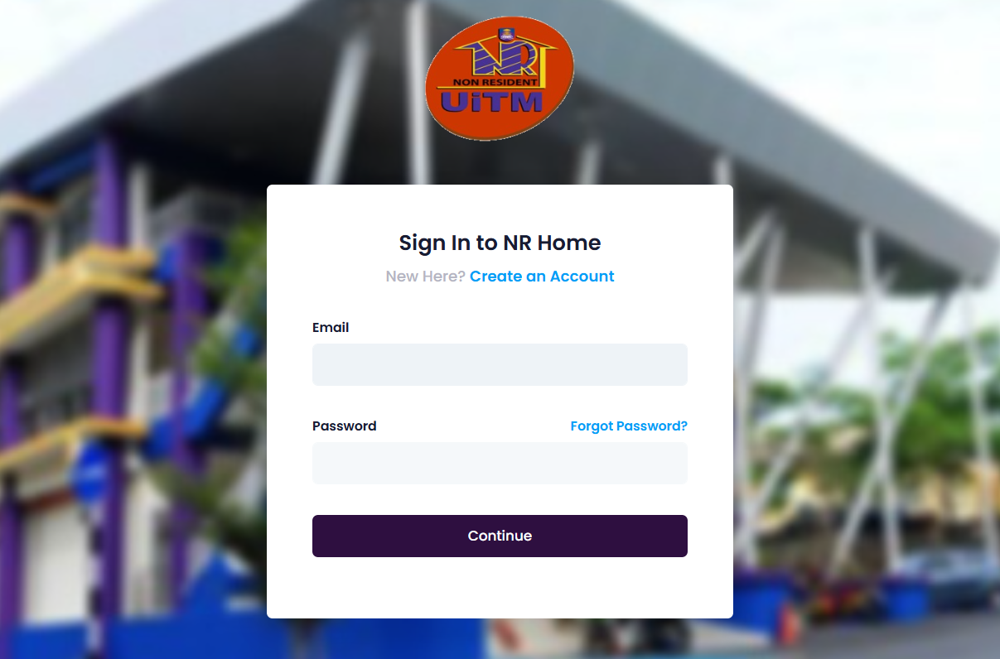
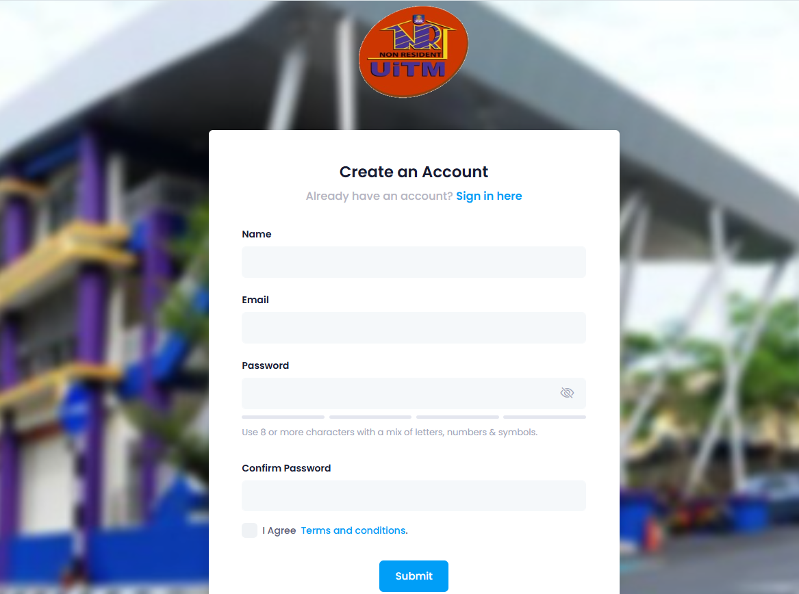
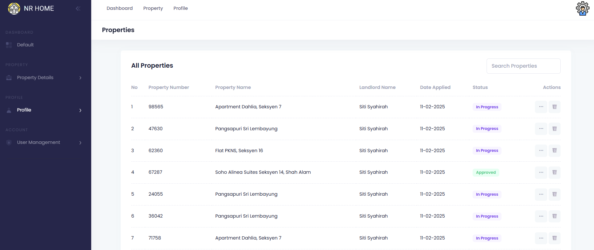
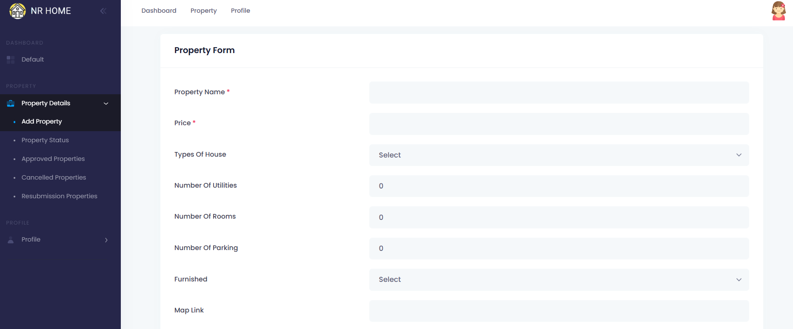
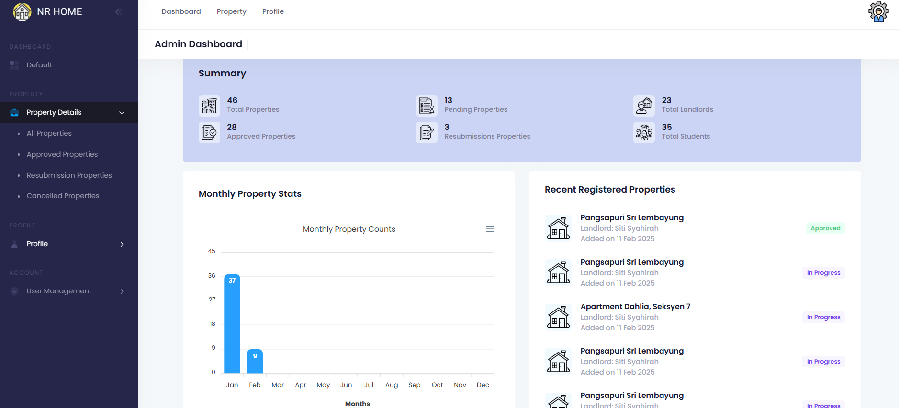
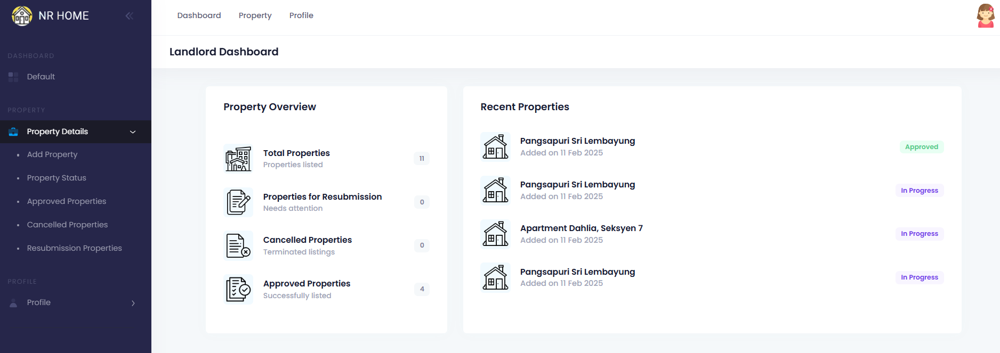
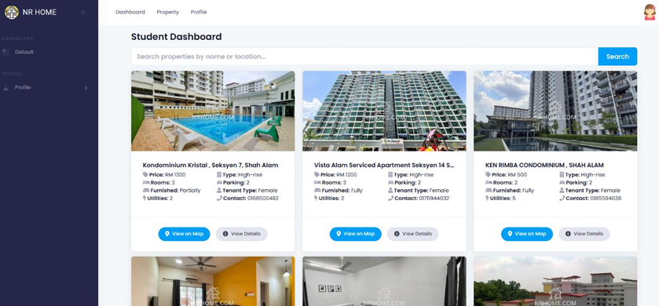

<h1 align="center">Non-Resident Rental House Web Application</h1>

## About
This project is a web-based application for managing non-resident rental houses. It includes features such as property listing, tenant management, booking, digital watermarking for rental documents, and a recommendation algorithm to suggest properties based on user preferences. Developed using Laravel and modern web technologies.

## Installation Guide
> - composer install  
> - copy .env.example .env  
> - php artisan key:generate  
> - npm install && npm run build  
> - php artisan migrate  
> - php artisan db:seed  
> - php artisan serve  

## Credentials
> - Admin : admin@demo.com || 123456  
> - Landlord : landlord@demo.com || 123456  
> - Tenant : tenant@demo.com || 123456  

## Screenshot of the System
<h3>Landing Page</h3>

<h3>Login & Register Page</h3>

<h3>Property Listing Page</h3>

<h3>Add Property Page</h3>

<h3>Admin Dashboard</h3>

<h3>Landlord Dashboard</h3>

<h3>Student Dashboard</h3>

## Features
- Property listing and search  
- Digital watermarking for rental documents  
- Recommender algorithm for student property suggestions  
- Role-based dashboards (Admin, Landlord, Student)  
- Booking and rental management  

## License
The Laravel framework is open-sourced software licensed under the MIT license. the [MIT license](https://opensource.org/licenses/MIT).
